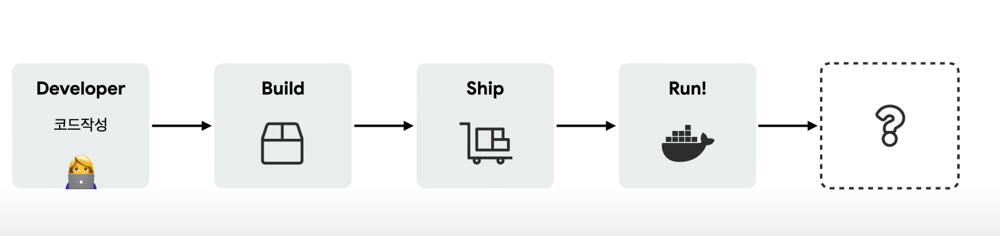
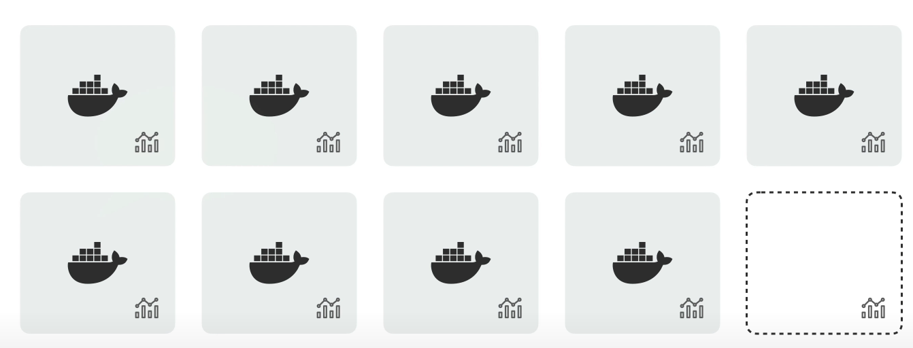
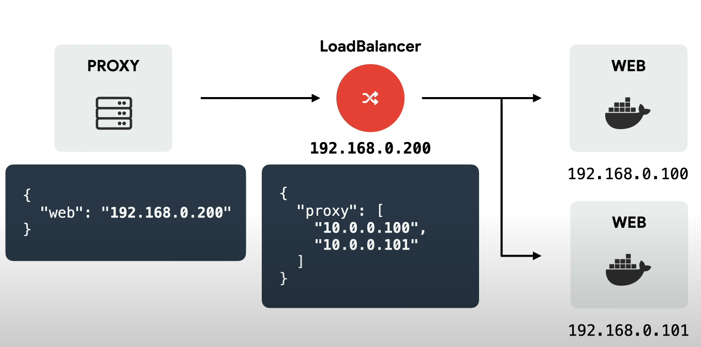
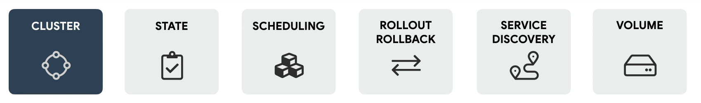
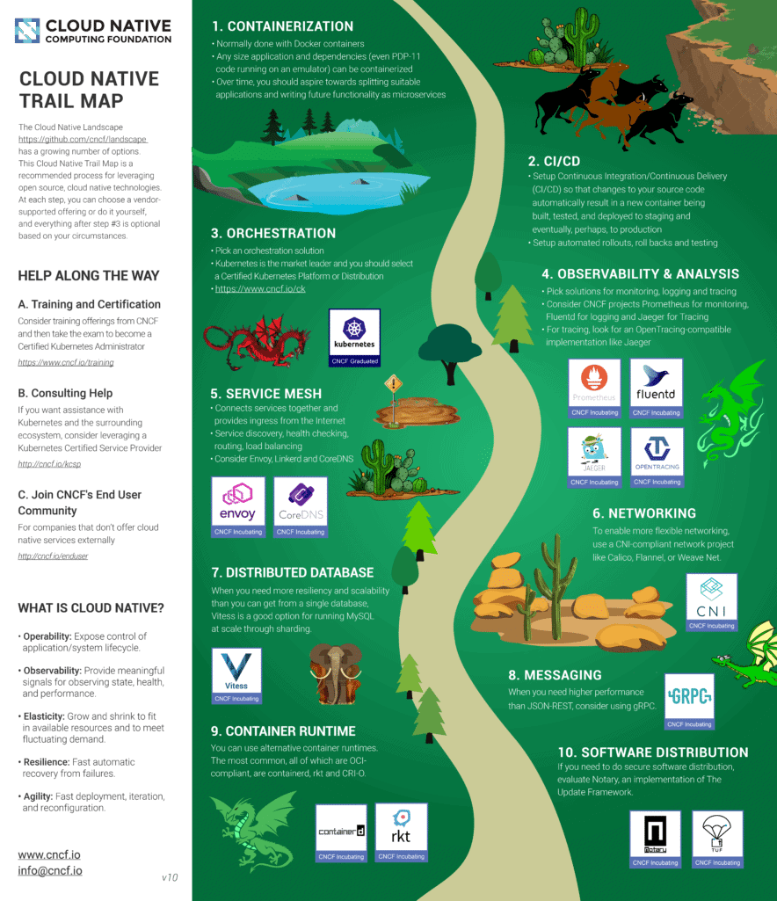
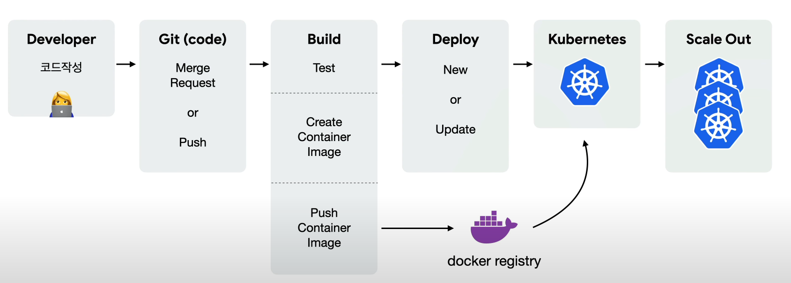

# Kubernetes
    

## 배경 

- 서버의 상태를 관리가 매우 어렵다 ( 갑자기 서버가 죽기도하고...)

    - 문서: 예전에는 서버를 운영하기 위해 문서에 운영방법을 적고 사용했었지만, 시간이 지나면서 문서의 정확성, 서버의 업데이트에 관련된 이력드를 관리하기가 힘들어지기 시작

    - 상태관리 : 상태관리 도구(`chef,puppet,ansible`)는 프로그램을 실행할 때 프로그램이 참조하는 설정파일을 코드로 작성하여 협업도 하고 버전관리도 할 수 있어 편리해졌다. 하지만 러닝커브가 높고 서버에서 다른 버전을 여러개 설치하는건 힘듬

    - 가상머신 : 한 서버에 여러개 설치가 쉽고, 현재 상태를 스냅샷으로 저장할 수도 있었지만, 처음부터 셋팅하는 방법이나 이미지 공유를 하기 힘들었으면, 속도 측면에서 좋지 않았다

    - 자원격리 : 리눅스 가상화 기술을 사용해 프로세스, 파일, 디렉토리를 가상으로 분리하여 속도도 빠르고 효율적인 서버 관리를 할수있었지만 러닝커브가 너무 높어 IT 대기업에서 사용하였다.

    - 이러한 단점들로 인해 쉽고 간편하게 관리할수 있는 방법이 없을까 고민하던 찰나에 2013년 Docker가 등장 했다.

    - 도커(Docker)는 컨테이너라는 격리된 환경에서 작동하는 프로세스를 오픈소스로 공개하였고 리눅스 커널의 여러 기술을 활용해 가성머신을 돌렸을때보다 훨씬 효율이 좋았다.

- 컨테이너의 특징

    - 가상머신과 비교하여 컨테이너 생성이 쉽고 효율적

    - 컨테이너 이미지를 이용해 배포와 롤백이 간단

    - 언어나 프레임워크에 상관없이 application을 동일한 방식으로 관리

    - 개발 테스팅, 운영 환경은 물론 로컬 피시와 클라우드까지 동일한 환경 구축

    - 특정 클라우드 벤더에 종속적이지 않음

    - 이것에 맛들리면 모든걸 컨테이너에 담기 시작하는데 이것을 containerization 이라고 한다
    > 하지만 컨테이너에 관리하기 시작한 프로그램이 커지면 이때부터 힘들다...

    

- 이렇게 늘어난 프로그램들의 배포는 어떻게 할까?

    - 할때마다 하나하나 `docker stop`을하고 `docker run`을 할수는 없다

    - 많은 서버들 중에서 어디 서버에 여유가 있는지 판단하기 힘듬

    

    - 또한 버전관리를 할때 컨테이너 마다 들어가서 관리하는게 너무 비효율적

- 서비스 검색은 어떻게 하지?

    - 서비스 검색이란 : 서비스가 이루어지는 것을 로드 밸런서와 같은 이치로 연결해주는것 

    

    - 실제 마이크로 서비스로 들어가면 관리하기 힘들어진다.

 
## 컨테이너 오케스트레이션

- 이러한 복잡한 환경으로 인해 효과적으로 관리하기 위한 도구 `컨테이너 오케스트레이션`이 탄생하게 된다.

    

- 컨테이너 오케스트레이션의 특징
    
    - 1.클러스터 : 서버가 많아지기 전까지는 하나씩 컨트롤 하지만, 클러스터를 이용해 관리하기 시작한다.

    - 2.상태관리 : 컨테이너의 상태 ( 컨테이너의 갯수 같은)를 자동으로 관리 해준다

    - 3.배포관리 : 서비스를 관리할때 여유가 있는 서버에 넣어야 하는데 이러한 스케쥴링도 해준다.

    - 4.버전관리 : 일일이 하나씩 했던 컨테이너를 통합적으로 바꿀수 있다.

    - 5.서비스 찾기 : 로드 밸런스에서 서버가 증가하면 추가해줘야 했지만 그 역할을 하고 프록시서버에서 서비스를 보는 형태

    - 6.볼륨 스토리지 : 컨테이너들 간의 클라우드 storage가 있을건데 이걸 관리 해준다.

## 쿠버네티스?

- 구글은 1주일에 20억개의 컨테이너를 생성하고 `borg`를 통해 관리하고 있었고 이걸통해 쿠버네티스를 개발

- 오픈소스라는 점이기 때문에 엄청난 인기를 이끌고 있다 `goolge,Red Hat,Huawai,VMware,Microsoft,IBM,Intel`

- 확장성면에서도 `kubeflow,TEKTON`같은 서비스들이 등장하고 있다.

- 쿠버네티스는 `컨테이너 오케스트레이`션의 `de facto`에 가깝다

- CNCF 로드맵
    

- 프로그램의 개발과정
    

- 쿠버네티스는 배포의 과정에서 문제를 이야기하는것이다.

## 데모 프로그램

    

