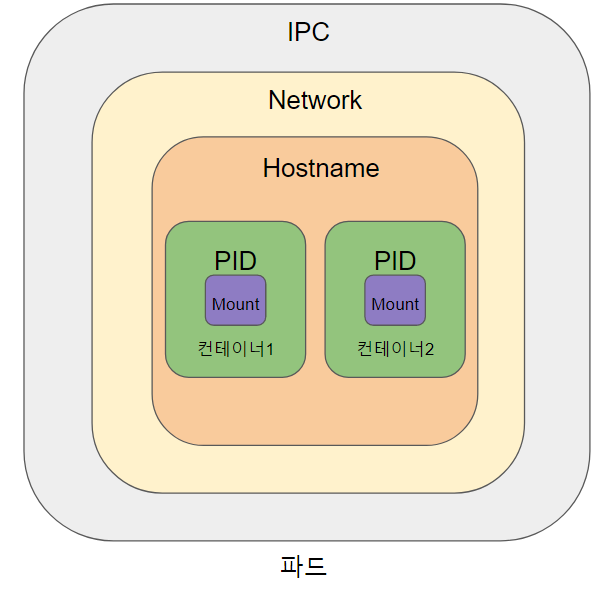

# 쿠버네티스에서 컨테이너 실행

- 3장에서 다루는 내용

  - 파드의 생성, 실행, 정지

  - 파드와 다른 리소스를 레이블로 조직화하기

  - 특정 레이블을 가진 모든 파드에서 작업 수행

  - 네임스페이스를 사용해 파드를 겹치지 않는 그룹으로 나누기

  - 특정한 형식을 가진 워커 노드에 파드 배치

---

## 3.1 파드란?

- `파드(Pod)` 는 `쿠버네티스`에서 생성하고 관리할 수 있는 배포 가능한 가장 작은 컴퓨팅 단위이다.

- 파드(pod of whales)는 하나 이상의 `컨테이너의 그룹`이다

- 파드의 콘텐츠는 항상 함께 배치되고, 함께 스케줄되며, 공유 콘텍스트에서 실행된다.

- 파드 안에 있는 컨테이너는 같은 노드에서 실행 된다.


## 3.1.1 파드의 필요

- 컨테이너를 직접 사용할 수 없는 이유는 무엇인가?

- 모든 프로세스를 `단일` 컨테이너에 넣을 수는 없는가?

- 컨테이너는 `격리된 머신`과 비슷하기 때문에 `여러 프로세스`를 `단일 컨테이너`에 돌리는것은 타당해 보인다

- 하지만 컨테이너는 `단일 프로세스`를 실행하는 것을 목적으로 설계했으며, 그것이 도커와 쿠버네티스를 사용하는 방법이다

  (하지만 다른 프로세스를 돌릴수는 있기 때문에 프로세스의 로그 관리는 사용자의 책임)

## 3.1.2 파드 이해하기

- 단일 프로세스를 구동시키는 컨테이너를 묶고 관리하는 하나의 단위가 필요한데, 그것이 `파드`다.

- `파드`를 통해 단일 컨테이너 안에서 모두 실행되는 것과 같은 환경을 제공하면서 `격리`가 가능하다.

- 그런데 컨테이너들 간에 완전히 격리가 된다고 배웠는데 어떻게 하나의 컨테이너에서 프로세스들이 관리 되는 것처럼 작동이 가능한 것일까?

- 쿠버네티스는 파드 안에 있는 컨테이너가 동일한 `리눅스 네임스페이스`를 공유하도록 도커를 설정한다

  

  - 파드 안에 컨테이너들은 기본적으로 `NET`, `IPC`, `UTS` namepsace를 공유한다.

  - 같은 `NET 네임스페이스` 안에 있기 때문에 기본적으로 같은 `포드`를 사용하지 않도록 주의 해야한다.

  - 기본적으로 `PID`는 분리가 되어있지만, 파드 spec에 `shareProcessNamespace` 옵션을 통해 공유 설정이 가능

  - 결론적으로 컨테이너들의 `namespace`를 일부 공유시켜 묶어준 것이 파드

- 쿠버네티스의 모든 파드들은 `플랫 네트워크`를 공유

  - 모든 파드는 다른 파드의 IP 주소를 사용해 접근히는 것이 가능하다.

  - 두 파드가통일 혹은 서로 다른 워커 노드에 있는지는 중요하지 않으며, 두 경우 모두 파드 안에 있는 컨테이너는 NAT 없는플랫 네트워크를 통해 서로 통신하는 것이 기능하다.
    

> 여기서 잠깐!!! 리눅스 네임스페이스란?

<details>
<summary>접기/펼치기</summary>

---

- 리눅스 네임스페이스는 프로세스 실행할때 시스템의 리소스를 분리해서 실행할 수 있도록 도와주는 기능입니다.

- 한 시스템의 프로세스들은 기본적으로 시스템의 리소스들을 공유해서 실행됩니다.

- 이를 단일 네임스페이스라고 생각해볼 수 있습니다.

- 네임스페이스의 종류

  1. `UTS namespace` : hostname을 변경하고 분할

  - 관련 명령어

    - `unshare`: unshare는 네임스페이스를 생성해서 프로세스를 생성하거나 영속화할 수 있도록 도와주는 명령어입니다.

    - `nsenter`: nsenter는 영속화 되어있는 네임스페이스에서 프로세스를 실행하는 명령어입니다.

    - `ip`: ip는 현재 시스템의 네트워크 상태에 대해서 조회하는 용도 뿐만 아니라, 네트워크 네임스페이스를 조작하는 용도로도 사용됩니다

  - example

    ```bash
        touch ./utsnsl  # 현재 디렉토리에 utsnsl파일을 만든다
    ```

    ```bash
        unshare --uts=./utsnsl hostname utsnsl
        #영속화된 네임스페이스에서 hostname을 utsns1로 변경하는 명령을 실행하라는 의미
    ```

    ```bash
        nsenter --uts=./utsnsl hostname # utsnsl의 네임스페이스를 확인해보기
        utsnsl # 결과물
    ```

  - 이렇게 몇개의 명령오로 UTS 네임스페이스를 분리가 가능하며 아래 코드를 통해 확인도 가능합니다

        

  2. `IPC namespace` : Inter-process communication. 프로세스간 통신 격리

  - IPC 네임스페이스는 프로세스가 자신의 System V IPC 객체와 POSIX 메시지 큐 자원을 가질 수 있게 한다

  3. `PID namespace` : PID (Process ID)를 분할 관리

  - PID 네임스페이스는 프로세스의 ID를 격리할 수 있는 네임스페이스입니다.

  - 리눅스에서 PID는 init 프로세스 1을 시작하며 그 외에 모든 프로세스는 항상 1보다 큰 PID를 부여받습니다.

  - PID 네임스페이스를 분리하면 PID가 다시 1부터 시작합니다.

  4. `NS namepsace` : file system 의 mount 지점을 분할하여 격리

  5. `NET namespace` : Network interface, iptables 등 network 리소스와 관련된 정보를 분할

  6. `USR namepsace` : 프로세스가 namespace 내부와 기본 namespace 간에 각기 다른 사용자 및 그룹 ID를 가질 수 있도록 지원

---

</details>

## 3.1.3 파드에서 컨테이너의 적절한 구성

- 파드는 각각의 머신보다는 `특정`한 `애플리케이션`만을 `호스팅`한다고 생각하면 좋다

- 한 호스트에 모든 유형의 애플리케이션을 넣었던 이전과 달리, 파드는 그렇지 않다.

- 파드는 상대적으로 가볍기 때문에 오버헤드 없이 필요한 만큼 파드를 가질수 있다.

- 모든 것을 파드 `하나`에 넣는 대신에 애플리케이션을 `여러 파드`로 구성하고, 각 파드에는 `밀접`하게 관련 있는 구성 요소나 `프로세스`만 포함해야 한다.

- 예를 들면 `프론트` 와 `백엔드`가 있다고 가정해보자

  - `프론트` 와 `백엔드`를 같은 파드에 넣고 실행한다면 워커 노드 하나만 사용하고 두번째 노드의 자원은 낭비되게 된다.

  - 하지만 `파드`를 두개로 나누어 돌리게 된다면 `인프라스트럭쳐`의 활용도를 향상 시킬수 있다

  - 또한 이렇게 하였을때 파드를 `수평적 확장`을 `스케일링`을 조절하기 좋다

- 그렇다면 파드안에 여러개의 컨테이너를 넣어야 하는 상황은 어떤것일까?
  

  - 위 그림은 파드안에 밀접하게 관련된 컨테이너로 구성되어 주 컨테이너와 이를 보조히는 컨테이너로 구성된 모습이다.

  - 이렇게 된다면 파드안에 여러개의 컨테이너를 넣어야하는 상황이 되는것이다.

- 그럼 여러개의 컨테이너를 넣어 될지 안될지 평가는 어떻게 하는것이 좋을까?

- 파드를 나눌지 말지에 대한 고민은 아래와 같은 조건을 통해 생각해보면 좋다.

  - 컨테이너를 함께 실행해야 히는가, 혹은 서로 다른 호스트에서 실행할수 있는가?

  - 여러 컨테이너가 모여 하나의 구성요소를 나타내는가 혹은 개별적인 구성 요소인가?

  - 컨테이너가 함께, 혹은 개별적으로 스케일링 돼야 하는가?

  

# 3.2 Yaml 또는 json으로 파드 생성

- `kubectl run`을 통해 간단한 리소스를 만들수 있지만, 이는 너무 제한적이다.

- 리소스의 모든것을 활용해 구성할려면 `Yaml` 과 `json` 파일을 전송해서 생성하는것이 적절하다.

- 파드 정의는 몇 부분으로 구성되며 YAML에서 시용하는 쿠버네티스 API 버전과 YAML이 설명히는 리소스 유형이 있다.

  - Metadata: 이름, 네임스페이스, 레이블 및 파드에 관한 기타정보를 포함한다.

  - Spec: 파드컨테이너, 볼륨 기타 데이터 등 파드 자체에 관한 실제 명세를가진다.

  - Status: 파드상태, 각컨테이너 설명과 상태, 파드내부 IP, 기타 기본 정보등 현재 실행 중인 파드에 관한 현재 정보를 포함한다.

- 이러한 개텀을 밭으로 yaml을 통해 간단하게 아래와 같이 작성해 보았다.

```yaml
apiVersion: v1 # 디스크립터 쿠버네티스 API 버전
kind: Pod      # 오브젝트 종류가 파드
metadata:
        name: kubia_manual # 파드 이름
sepc:
  containers:
  - image: luksa/kubia # 컨테이너를 만드는 컨테이너 이미지
      name: kubia # 컨테이너 이름
      ports:
      - containerPort: 8080 #애플리케이션이 수신하는 포트
          protocol: TCP
```

- 포트 정의 안에서 포트르 지정한것은 단지 정보에 불과하면 이를 생략해도 다른 클라이언트에서 포트를 통해 파드에 연결할 수 있는 여부에 미치지 않는다.

- 컨테이너가 0.0.0.0 주소에 열어 둔 경우 다른 파드에서 항상 해당 파드에 적속이 가능하다

- 그럼 이제 `yaml` 파일을 `파드`로 만들기 위해 `kubectl create` 명령어를 이용해보자

  ```bash
  kubectl create -f kubia-manual.yaml
  pod "kubia-manual" created
  ```

- 실행 중인 파드에게 yaml을 요청할수 있다.

  ```bash
  kubectl get po kubia-manula -o yaml # yaml으로 보기

  kubectl get po kubia-manula -o json # json으로 보기
  ```

- 생성된 파드 목록보기

  ```bash
  kubectl get pods

  ```

- 파드의 로그 가져오기

  ```bash
  kubectl logs kubia-manual
  kubia server starting
  ```

- 파드의 요청 보내기

  - 서비스를 거치지 않고 특정 파드와 연결 하고 싶을 때 쿠버네티스는 포트 포워딩을 구성해준다.

  ```bash
  kubectl port-forward kubia-manual 8888:8080
  # 로컬 네트원크 포트를 파드의 포트로 포워딩
  ```

## 3.3 레이블을 이용한 파드 구성

- 우리는 아래와 같이 애플리케이션을 배포할 때 많은 파드를 실행하게 될 것이다.
  

- 파드 수가증가함에 따라 파드를 부분 집합 으로 분류할 필요가 있으며 이는 레이블을 통해 쿠버네티스의 조직화가 이뤄진다.

- 레이블은 리소스를 첨부할때 `key-value` 형태의 값으로 구성되어있다.

- 우리는 위 예제를 아래와 같이 `app` 과 `rel`이라는 형태의 레이블을 붙여 보았다.
  

## 3.3.2 파드를 생성할때 레이블 지정

- 아래와 같이 yaml 파일을 만들고 레이블 코드를 추가 시켜보았다

```yaml
apiVersion: v1 # 디스크립터 쿠버네티스 API 버전
kind: Pod      # 오브젝트 종류가 파드
metadata:
   name: kubia_manual-v2 # 파드 이름
   labels:
   creation method: manual #creation_method=manual과 env=prod를 metadata.labels 섹션에 포함
   env: prod
sepc:
  containers:
  - image: luksa/kubia # 컨테이너를 만드는 컨테이너 이미지
      name: kubia # 컨테이너 이름
      ports:
      - containerPort: 8080 #애플리케이션이 수신하는 포트
          protocol: TCP
```

- 이를 `kubectl create -f kubia-manual-with-labes.yaml`을 통해 파드를 생성한다.

- 생성된 파드가 잘 들어갔는지 확인 하기 위해 아래 코드를 입력한다

```bash
kubectl get po --show-labels # 모든 레이블

kubectl get po -L creation_method,env # 특정 레이블
```

- 만약 파드의 레이블을 수정 해야 할경우 아래 명령어를 입력한다.

```bash
kubectl label po kubia-manual creation_method=manual # 기존에 만든 kubia-manual에 라벨 추가

kubectl label po kubia-manual-v2 env=debug --overwrite # env를 prod에서 debug로 수정
```

## 3.4 레이블 셀렉터를 이용한 파드 부분 집합 나열

- 레이블 셀렉터를 통해 태그된 파드의 부분 집합을 선택해 원하는 작업이 가능하다.

- 레이블 셋렉터는 특정 값과 레이블을 갖는지 여부에 따라 리소스를 필터링 하는 기준이 된다.

  - 특정한커를포함하거나포함하지 않는레이블

  - 특정한키와값을가진레이블

  - 특정한 커를 갖고 있지만, 다른 값을 가진 레이블

## 3.4.1 레이블 셀렉터를 사용해 파드 나열

- 레이블 셀렉터를 사용해보자

```bash
kubectl get po -l creation_method=manual  # creation_method=manual이 붙은 포드 확인

kubectl get po -l env #env 레이블을 가지고 있지만, 값은 무엇이든 상관없는 파드

kubectl get po -l '!env' #env 레이블을 가지고 있지 않은 파드
```

## 3.5 레이블과 셀렉터를 이용해 파드 스케줄링 제한

- 지금까지 생성한 모든 파드는 워커 노드 전체에 걸쳐 무작위로 스케줄링됐다.

- 만약 하드웨어 인프라가 동일하지 않을 경우 (ssd, hdd 혼용) 스케줄링이 필요할수 있다.

- 하지만 쿠버네티스는 위에 실행되는 애플리케이션으로부터 실제 인 프라스트럭처를 숨기는 것 이기에 스케줄링을 지정하고 싶지 않다.

- 이를 지정하면 애플리케이션이 인프라에 결합이 되기 때문이다.

- 그러나 정확한 노드를 지정하는 대신 필요한 요구사항을 기술하고 요구사항에 만족하는 노드를 선택한다.

## 3.5.1 워커 노드 분류에 레이블 사용

- 레이블은 파드에만 부착할수 있는 것이 아니라 쿠버네티스 오브젝트에 부착할수 있는것이다.

- 예를 들어 GPU를 가지는 노드가 있다고 가정 했을때 이 기능을 가지고 있음을 보여주는 노드를 추가하고자 한다.

  ```bash
  kubectl label node gke-kubia-85f6-node-0rrx gpu=true # gpu=true 라는 라벨을 부착
  node ” gke-kubia-85f6-node-0rrx” labeled
  ```

- 이제 파드를 선택할때 gpu가 있는 노드를 쉽게 찾을수 있다.

  ```bash
  kubectl get nodes -1 gpu=true
  ```

## 3.5.2 특정 노드에 파드 스케줄링

- 이제 GPU를 필요하는 새로운 파드를 배포한다고 가정 해보자

- `gpu: 'true'` 라는 라벨을 yaml 파일에 추가하고 파드를 생성해보자

## 3.6 파드에 어노테이션 달기

- 파드 및 다른 오브젝트는 레이블 외에 어노테이션을 가질 수 있다.

- 어노테이션은 `key-value`값으로 레이블과 거의 비슷하지만 식별 정보를 갖지 않는다.

- 따라서 레이블 처럼 오브젝트를 묶는데 사용할수 없으며 셀렉터를 구동 불가핟.

- 하지만 어노테이션은 많은 정보를 보유할수 있다(일반적인 코드의 어노테이션을 생각하면 된다)

## 3.6.1 오브젝트의 어노테이션 조회

- `kubectl get po kubia-zxzij -o yaml`를 통해 미리 만든 파드 의 yaml 파일을 보면 `annotations`라 적힌 부분이 있다.

## 3.6.2 어노테이션 추가 및 수정

- 레이블을 만들 때와 같은 방법으로 파드를 생성할 때 어노테이션을 추가할 수 있다.

- 어노테이션을 추가히는 가장 간단한 방법은 `kubectl annotate` 명령을 사용하는 것이다

  ```bash
  kubectl annotate pod kubia-manual mycompany.com/someannotation=”foo bar”
  pod ” kubia-manual” annotated
  ```

- 이렇게 하면 어노테이션을 foo bar라는 값과 함께 추가할수있다.

- 또한 추가했다. key 충돌을 방지하기 위해 어노테이션 key로 이런 형식을 사용하는 것이 좋다.

  ```bash
  kubectl desc「ibe pod kubia-manual # 어노테이션 확인
  ```

## 3.7 네임스페이스를 사용한 리소스 그룹화

- 만약 오브젝트를 겹치지 않는 그룹으로 분할하고자 할 때는 어떻게 해야 할까?

- 쿠버네티스는 오브젝트를 네임스페이스로 그룹화한다. (여기서 네임스페이스는 리눅스 네임스페이스가 아니다)

- 쿠버네티스 네임스페이스는 오브젝트 이름의 범위를 제공

## 3.7.1 네임스페이스의 필요성

- 여러 네임스페이스를 사용하면 복잡한 시스템을 좀 더 작은 개별 그룹으로 분리가 가능하다.

- 또한 멀티테넌트 환경처럼 리소스 분리가 가능하다.

## 3.7.2 다른네임스페이스와 파드 살펴보기

- 먼저 클러스터에 있는 모든 네임스페이스를 나열 해보자

  ```bash
  kubectl get ns
    default <none> Active 1h
    kube-public <none> Active 1h
    kube-system <none> Active 1h
  ```

- 위 명령어를 치면 모든 네임스페이스가 나타나 게 되는데 우리는 현재까지 default의 네임스페이스에서만 작업을 진행했음을 알수있다.

- 그렇다면 `kube-system` 이라는 네임스페이스 안에 어떤 파드가 있는지 알기 위해 아래 명령어를 쳐보자

  ```bash
  kubectl get po --namespace kube-system

  NAME READY STATUS RESTARTS AGE
  fluentd-cloud-kubia-e8fe-node-txje 1/1 Running 0 lh
  heapster-vll-fzlge 1/1 Running 0 lh
  kube-dns-v9-p8a4t 0/4 Pending 0 lh
  kube-ui-v4-kdlai 1/1 Running 0 lh
  17-lb-controller-v0.5.2-bue96 2/2 Running 92 lh
  ```

- 여기서 나온는 내용은 현재 알수가 없으니 나중으로 패스 하도록해보자

## 3.7.3 네임스페이스 생성

- 네임 스페이스의 생성은 `yaml`파일에서 설정할수 있다.

  ```yaml
  apiVersion: vl
  kind: Namespace #네임스페이스 정의
  metadata:
  name: custom-namespace # 네임스페이스의 이름
  ```

- 하지만 이러한 방식은 여전히 불편하고 번거로운데 우리는 `kubectl create namespace`이라는 명령어를 통해 쉽게 진행할수있다.

  ```bash
  kubectl create namespace custom-namespace
  ```

## 3.7.4 다른 네임스페이스의 오브젝트 관리

- metadata 섹션에 namespace: custom-namespace 항목을 넣거나 kubectl create 명령을 사용할 때 네임스페이스를 지정한다.

  ```bash
  kubectl create -f kubia-manual.yaml -n custom-namespace
  ```

-다른 네임스페이스 안에 있는 오브젝트를 나열하거나 어노테이션 달기, 수정 또는 삭제할 때는 --namespace (또는 -n) 플래그를 kubectl에 전달해야 한다.

## 3.7.5 네임스페이스가 제공하는 격리 이해

- 네임스페이스를 시용하면 실행 중인 오브젝트에 대한 격리는 제공하지 않는다.

- 서로 다른 네임스페이스에 파드를 배포할 때 해당 파드가 서로 격리돼 통신할 수 없다고 생각할 수 있지만 반드시 그런 것은 아니다.

- 특정 파드가 다른 파드이 ip주소를 알고 있다면 HTTP 요청과 같은 트래픽을 다른 파드로 보내는것에 제약 사항은없다.

## 3.8 파드 중지와 제거

- 파드를 제거하는 방법에 대해 알아보자

- 제거 방법은 delete 명령어에 원하는 파드 이름을 작성하면된다.

  ```bash
  kubectl delete po kubia-gpu #kubia-gpu 삭제
  ```

- 파드를 삭제하면 쿠버네티스는 파드 안에 있는 모든 컨테이너를 종료 지시하고

- 쿠버네티스는 SIGTERM 신호를 프로세스에 보내고 지정된 시간 동안 기다린다.

- 시간 내에 종료되지 않으면 SIGKILL 신호를 통해 종료 한다.

## 3.8.2 레이블 셀렉터를 이용한 파드 삭제

- 레이블 셀렉터를 통해 파드를 삭제할수 있다.

  ```bash
  kubectl delete po -1 creation_method=manual
  ```

- 이렇게 하면 렝비ㅡㄹ에 지정된 파드를 한번에 지울수 있는 편리함이 있다.

## 3.8.3 네임스페이스를 삭제한 파드 제거

- 아래와 같은 명령어를 통해 네임스페이스 전체를 삭제할수 있다.

  ```bash
  kubectl delete ns custom-namespace
  ```

## 3.8.4 네임스페이스를 유지하면서 네임스페이스 안에 있는 모든 파드 삭제

- 특정 파드를 삭제히는 대신 --all 옵션을 이용해 쿠버네티스가 현재 네임스 페이스에 있는 모든 파드를 삭제하도록한다.

  ```bash
  kubectl delete po --all
  ```

## 3.8.5 네임스페이스에서 (거으” 모든 리소스 삭제)

- 하나의 명령으로 현재 네임스페이스에 있는 모든 리소스(레플리게이션컨트롤러, 파드, 생성한 모든서비스)를삭제할수 있다.

  ```bash
  kubectl delete all --all
  ```

- 명령의 첫 번째 all은모든유형의 리소스를삭제하도록 지정하고, --all 옵션으로 리소스 이름이 아닌 모든 리소스 인스턴스를 삭제할 것을 지정한다

## 3.9 요약

- 특정 컨테이너를파드로묶어야승}는지 여부를결정하는방법
- 파드는 여러 프로세스를 실행할수 있으며 컨테이너가 아닌 세계의 물리적 호스트
  와비슷하다 .
- Y뻐tlL 또는 JSON 디스크립터를작성해파드를작성하고파드정의와상태를확인
  할수있다.
- 레이블과 레이블 셀렉터를 사용해 파드를 조직하고 한 변에 여러 파드에서 작업을
  쉽게수행할수있다.
- 노드 레이블과 셀렉터를 사용해 특정 기능을 가진 노드에 파드를 스케줄링할 수
  있다.
- 어노테이션을 사용하면 사람 또는 도구, 라이브러리에서 더 큰 데이터를 파드에 부
  착할수있다.
- 네임스페이스는 다른 팀들이 동일한 클러스터를 별도 클러스터를 사용히는 것처럼
  이용할수있게해준다.
- kubectl explain 명령으로 쿠버네티스 리소스 정보를 빠르게 찾을 수 있다.
